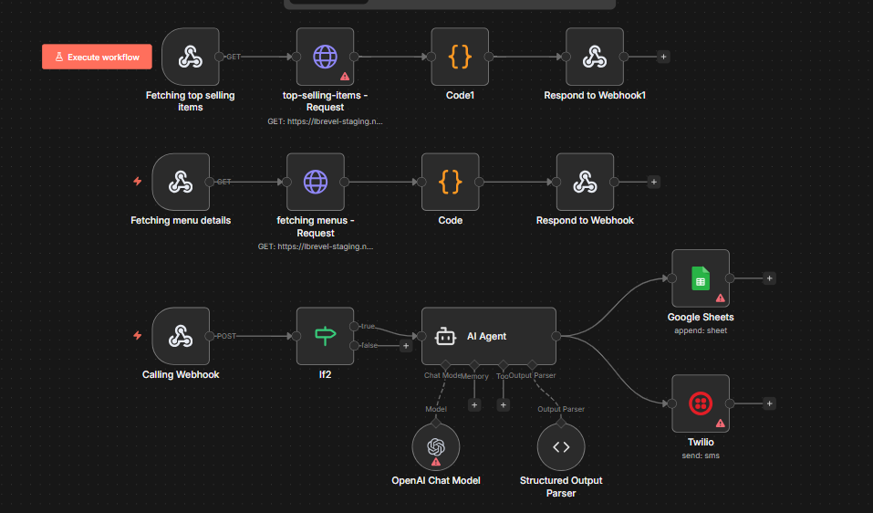

# 🍽️ AI-Powered Food Ordering System (Voice Automation)

## Overview
This automation was built to solve a real-world restaurant operations problem: handling high call volumes during peak hours without compromising order accuracy or customer experience.

During rush hours, restaurant phone lines often become overloaded—leading to missed calls, delayed orders, and frustrated customers. This system replaces manual call handling with an AI-powered voice assistant that manages food orders end-to-end.

---

## 🧩 Problem Statement
- Peak-hour call overload  
- Missed or incorrectly noted orders  
- Limited staff availability  
- Inconsistent customer experience  
- No after-hours call handling  

---

## 🚀 Solution
We introduced an AI voice agent that acts as a virtual order taker.

The AI:
- Answers every incoming call instantly  
- Explains the restaurant menu clearly  
- Takes customer orders through natural conversation  
- Handles item customization and delivery preferences  
- Automatically records and forwards the order to the system  

This ensures zero missed calls, faster order processing, and a consistent customer experience, even during peak hours.

---

## ⚙️ How the Automation Works

### Menu Fetching
- Restaurant menu is fetched dynamically via API.
  

### Incoming Call Handling
- Calls are handled by an AI voice agent powered by **Retell.ai**.

### Conversational Ordering
- AI explains menu items  
- Takes orders naturally (supports customizations)  
- Confirms order details with the caller  

### Order Processing
- Final order is structured and sent to backend systems via **n8n**  
- Ready for fulfillment without manual intervention  

---

## 🧠 AI Capabilities
- Natural, human-like voice conversations  
- Context-aware responses  
- Order clarification and confirmation  
- Customization handling  
- Continuous availability (24×7)  

---

## 🛠 Tech Stack & Integrations
- **n8n** – Workflow orchestration  
- **Retell.ai** – AI voice calling  
- Restaurant Menu API  
- LLMs – Conversational intelligence  
- Webhooks & HTTP APIs  

---

## 📸 Demo & Screenshots
- Workflow diagrams and call-flow screenshots are available in the `screenshots/` folder.  
- Demo video showcases real-time AI call handling and order capture.

---

## 🎯 Business Impact
- Zero missed calls  
- Reduced staff load  
- Faster order turnaround  
- Consistent ordering experience  
- Works 24×7 without downtime  

---

## 🏪 Ideal Use Cases
- Restaurants  
- Food chains  
- Cloud kitchens  
- Voice-commerce platforms  

---

## 🔒 Notes
- Credentials and API keys are removed  
- Workflow is modular and extensible  
